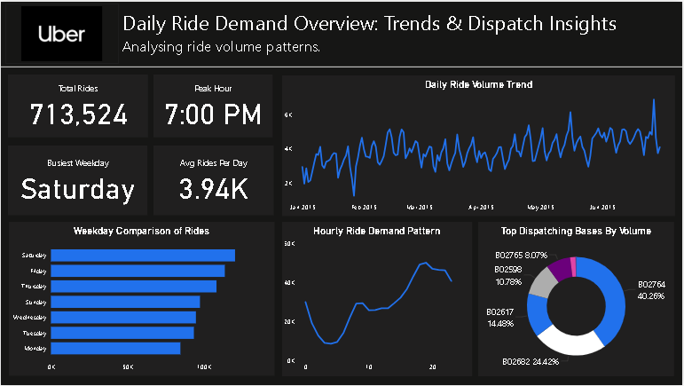

# 🚖 Ride-Sharing Demand Forecasting & Surge Pricing Insights

This end-to-end data analytics project explores patterns in ride-sharing demand and surge pricing using Uber/FHV data. Built with Python and Power BI, it delivers insights into peak hours, base activity, and surge patterns — enabling better operational and pricing decisions.



---

## 📌 Project Overview

- **Dataset**: Downsampled version of Kaggle’s NYC Uber/FHV ride data (Jan–June 2015)
- **Tools Used**:  
  - Python (Pandas, Matplotlib, Seaborn)  
  - Power BI (Data Modeling + Visual Dashboards)  
  - Jupyter Notebook

---

## 🎯 Objectives

- Analyze temporal ride demand (hour, weekday, month)
- Identify surge-like high-demand periods using Z-scores
- Visualize base-wise performance
- Create interactive dashboards for insights

---

## 🧾 Dataset Description

| Column                 | Description                               |
|------------------------|-------------------------------------------|
| `Dispatching_base_num` | Base/dispatch code of the ride            |
| `Pickup_date`          | Ride pickup timestamp                     |
| `locationID`           | Zone code or ID for pickup (if available) |
| `Affiliated_base_num`  | Associated base number (where present)    |

📁 Cleaned data saved as: `data/processed/uber_sampled_cleaned.csv`

---

## 📊 Key Dashboards (Power BI)

| Page | Description |
|------|-------------|
| **Page 1**: Daily Ride Demand Overview | KPIs, trends by hour/weekday/month |
| **Page 2**: Base Performance & Surge Hotspots | Top-performing dispatch bases, surge zones |
| **Page 3**: Strategic Business Insights | Actionable metrics for supply planning |

All dashboards use Uber’s dark-blue theme:  
- Background: `#121212`  
- Highlight: `#2171ec`  
- Text: `#ffffff`  
- Accent: `#e7e8ec`, `#adadad`

---

## 🛠 Folder Structure

```
Ride-Sharing-Insights/
│
├── data/
│   ├── raw/                # Original Kaggle files
│   ├── processed/          # Cleaned & downsampled files
│
├── output/
│   ├── visualizations/     # PNG screenshots of dashboards
│   ├── base_hourly_rides.csv
│   ├── base_total_rides.csv
│   ├── surge_hourly_demand.csv
│   └── uber_sampled_cleaned.csv
│
├── notebooks/
│   └── ride_sharing_analysis.ipynb
│
├── dashboard/
│   └── RideSharingInsights.pbix   # Power BI file (if public)
│
├── requirements.txt
└── README.md
```

---

## 🔍 Key Insights

- Highest ride activity occurs during 5 PM–8 PM (evening peak).
- Friday shows the highest surge periods.
- Bases like **B02598** dominate ride volume.
- Clear patterns support time-based pricing models.

---

## 💡 Future Improvements

- Full-year analysis for seasonality
- Location mapping (e.g., NYC boroughs)
- Driver performance integration
- Forecasting models with Prophet or LSTM

---

## 🚀 Getting Started

### 1. Clone the Repository

```bash
git clone https://github.com/your-username/Ride-Sharing-Insights.git
cd Ride-Sharing-Insights
```

### 2. Install Dependencies

```bash
pip install -r requirements.txt
```

### 3. Run the Notebook

Launch the Jupyter notebook:

```bash
jupyter notebook notebooks/ride_sharing_analysis.ipynb
```

### 4. Open Power BI

Open the `.pbix` file in the `dashboard/` folder to explore the interactive dashboard.

---

## 🙏 Acknowledgements

- Kaggle for the original NYC FHV dataset
- Uber brand palette for dashboard styling

---

Made with 💻 by **Divyansh Dhadhich**  
📧 [divyanshdhadhich@gmail.com](mailto:divyanshdhadhich@gmail.com)  
🔗 [LinkedIn](https://www.linkedin.com/in/divyansh-dhadhich)
